####目录
* [LBStoreMall](#LBStoreMall)
	* [tabbar的实现](#LBStoreMall_tabBar) 
	* [顶部导航栏的实现](#LBStoreMall_topNav)
	* [首页布局的实现](#LBStoreMall_HOME)
	* [快速返回顶部实现](#LBStoreMall_return_top)

* [下拉刷新图片放大效果](#下拉刷新图片放大效果)


----
####

## <a id="LBStoreMall">LBStoreMall 电商，只弄了首页</a>
[来源](https://github.com/lb2281075105/LBStoreMall) [本地](LBStoreMall/LBStoreMall)

*  <a id="LBStoreMall_tabBar" href="https://github.com/lb2281075105/LBStoreMall/blob/master/LBStoreMall/LBStoreMall/classes/controller/main/LBSMTabBarController.m">tabBar的封装源码</a>，tabBar效果图：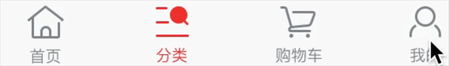


````
   1，继承自UITabBarController
   2，封装一个方法添加nav控制器
   ///添加子控制器
	- (void)addChildViewController:(UIViewController *)childController withNormalImage:(NSString *)normalImage withSelectImage:(NSString *)selectImage withTitle:(NSString *)title{	
	    .....
	    LBSMNavController *nav = [[LBSMNavController alloc]initWithRootViewController:childController];
	    nav.tabBarItem.image = [[UIImage imageNamed:normalImage]imageWithRenderingMode:UIImageRenderingModeAlwaysOriginal];
	    nav.tabBarItem.selectedImage = [[UIImage imageNamed:selectImage]imageWithRenderingMode:UIImageRenderingModeAlwaysOriginal];
	    ///（当只有图片的时候）需要自动调整
	    nav.tabBarItem.imageInsets = UIEdgeInsetsMake(6, 0,-6, 0);
	
	    [self addChildViewController:nav];
	}
	3，在viewdidload方法里面调用addChildViewController添加控制器
````
* 点击tabBar动画实现思路如下：[TabBarItem添加动画的一种思路](https://www.jianshu.com/p/89d3fb9949ff)

````
  1，实现UITabBarControllerDelegate
  2，在tabBar的代理方法：- (void)tabBarController:(UITabBarController *)tabBarController didSelectViewController:(UIViewController *)viewController中
  3，在代理方法中获取选中的UITabBarButton
  4，遍历UITabBarButton中的subView，找到imageView,为ImageView添加动画
  
代码如下：
	// 代理方法
- (void)tabBarController:(UITabBarController *)tabBarController didSelectViewController:(UIViewController *)viewController{
    //点击tabBarItem动画
    [self tabBarButtonClick:[self getTabBarButton]];
}

// 点击动画
- (void)tabBarButtonClick:(UIControl *)tabBarButton
{   // tabBarButton 上面有图片和title
    for (UIView *imageView in tabBarButton.subviews) {
        if ([imageView isKindOfClass:NSClassFromString(@"UITabBarSwappableImageView")]) {
            // 需要实现的帧动画,这里根据自己需求改动
            CAKeyframeAnimation *animation = [CAKeyframeAnimation animation];// 关键帧动画
            animation.keyPath = @"transform.scale";
            animation.values = @[@1.0,@1.1,@0.9,@1.0];//原图->放大->缩小->原图
            animation.duration = 0.3;//持续时间
            animation.calculationMode = kCAAnimationCubic;
            // 添加动画
            [imageView.layer addAnimation:animation forKey:nil];
        }
    }
}

- (UIControl *)getTabBarButton{
    NSMutableArray *tabBarButtons = [[NSMutableArray alloc]initWithCapacity:0];
    
    for (UIView *tabBarButton in self.tabBar.subviews) {
        if ([tabBarButton isKindOfClass:NSClassFromString(@"UITabBarButton")]){
            [tabBarButtons addObject:tabBarButton];
        }
    }
    // 点击了那个index
    UIControl *tabBarButton = [tabBarButtons objectAtIndex:self.selectedIndex];
    LBSMLog(@"%lu",(unsigned long)self.selectedIndex);
    return tabBarButton;
}
   
````


-------

* <a id="LBStoreMall_topNav">顶部导航栏的实现</a>

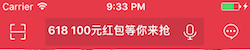

* 相关代码：[LBSMHomeController setUpNav](https://github.com/lb2281075105/LBStoreMall/blob/master/LBStoreMall/LBStoreMall/classes/controller/home/LBSMHomeController.m)    [LBTitleView](https://github.com/lb2281075105/LBStoreMall/blob/master/LBStoreMall/LBStoreMall/classes/view/titleView/LBTitleView.m)  [LBSMSearchTextField](https://github.com/lb2281075105/LBStoreMall/blob/master/LBStoreMall/LBStoreMall/classes/view/search/LBSMSearchTextField.m)

````
1,红色背景为颜色：
    self.navigationController.navigationBar.barTintColor = LBSMColor(231, 23, 37);
2，左右两边分别为leftBarButtonItem和rightBarButtonItem
	self.navigationItem.leftBarButtonItem = [UIBarButtonItem ItemWithImage:[UIImage imageNamed:@"richScan"] WithHighlighted:[UIImage imageNamed:@"richScan"] Target:self action:@selector(richScanItemClick)];
    self.navigationItem.rightBarButtonItem = [UIBarButtonItem ItemWithImage:[UIImage imageNamed:@"message"] WithHighlighted:[UIImage imageNamed:@"message"] Target:self action:@selector(messageItemClick)];
3,中间部份为一个自定义view，中间那个view的核心代码如下：
	- (void)addSubviews{
	    /// 设置圆角
	    UIBezierPath *maskPath = [UIBezierPath bezierPathWithRoundedRect:self.bounds byRoundingCorners:UIRectCornerTopLeft | UIRectCornerTopRight | UIRectCornerBottomLeft | UIRectCornerBottomRight cornerRadii:CGSizeMake(2, 2)];
	    CAShapeLayer *maskLayer = [[CAShapeLayer alloc] init];
	    maskLayer.frame = self.bounds;
	    maskLayer.path = maskPath.CGPath;
	    self.layer.mask = maskLayer;
	    self.placeholder = _title;
	    if (_orTrue) {
	        //用KVC设置placeholder的文字颜色与字体
	        [self setValue:[UIColor whiteColor] forKeyPath:@"_placeholderLabel.textColor"];
	        [self setValue:[UIFont boldSystemFontOfSize:14] forKeyPath:@"_placeholderLabel.font"];
	        /// 搜索按钮
	        _rightBtn = [UIButton buttonWithType:UIButtonTypeCustom];
	        [_rightBtn setImage:[UIImage imageNamed:@"voice"] forState:UIControlStateNormal];
	        [_rightBtn addTarget:self action:@selector(rightButtonClick) forControlEvents:UIControlEventTouchUpInside];
	        [self addSubview:_rightBtn];
	        [_rightBtn mas_makeConstraints:^(MASConstraintMaker *make) {//自定义view右边按钮的约束
	            make.centerY.equalTo(self);
	            make.height.with.equalTo(@20);
	            make.right.equalTo(self).offset(-5);
	        }];
	
	    }else{
	        [self setValue:[UIColor whiteColor] forKeyPath:@"_placeholderLabel.textColor"];
	        [self setValue:[UIFont boldSystemFontOfSize:14] forKeyPath:@"_placeholderLabel.font"];
	    }
	}
	   
````
----
#### <a href="LBStoreMall-master/LBStoreMall/LBStoreMall/classes/controller/home/LBSMHomeController.m" id="LBStoreMall_HOME">首页的布局的实现</a>  [UICollectionView使用](https://my.oschina.net/u/2340880/blog/522613)
-----
* 整体效果：，首页又分为5个section：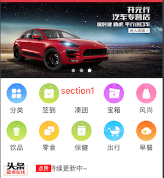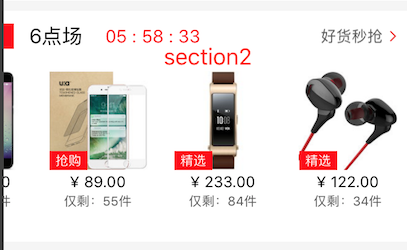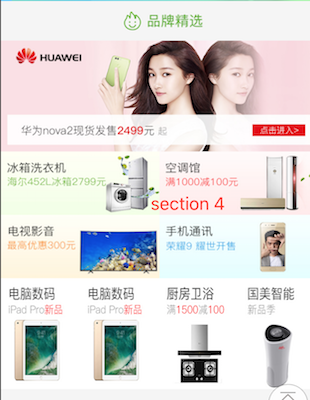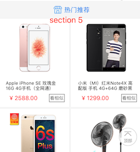

````
 1，整个首页内容是一个UICollectionView，其中UICollectionView分成了五个section,第个section又分为头、cell、尾；

	 - (UICollectionView *)collectionView{
	    if (_collectionView == nil) {
	        UICollectionViewFlowLayout *layout = [[UICollectionViewFlowLayout alloc]init];
	        _collectionView = [[UICollectionView alloc]initWithFrame:CGRectZero collectionViewLayout:layout];
	        /// 不用设置集合视图的具体frame
	        /// 需要时设置滑动方向
	        _collectionView.frame = CGRectMake(0, 64, [UIScreen cz_screenWidth], [UIScreen cz_screenHeight] - 64 - 49);
	        _collectionView.showsVerticalScrollIndicator = NO;
	        _collectionView.delegate = self;
	        _collectionView.dataSource = self;
	        /// cell
	        [_collectionView registerClass:[LBSMHomeGridCell class] forCellWithReuseIdentifier:HomeGridCell];
	        [_collectionView registerClass:[LBSMHaoHuoCell class] forCellWithReuseIdentifier:HaoHuoCell];
	        [_collectionView registerClass:[LBSMNeedLifeCell class] forCellWithReuseIdentifier:NeedLifeCell];
	        [_collectionView registerClass:[LBSMPinPaiJingXuanCell class] forCellWithReuseIdentifier:PinPaiJingXuanCell];
	        [_collectionView registerClass:[LBSMHotCommendCell class] forCellWithReuseIdentifier:HotCommendCell];
	
	        /// header
	        //轮播图
	        [_collectionView registerClass:[LBSMSlideshowHeadView class] forSupplementaryViewOfKind:UICollectionElementKindSectionHeader withReuseIdentifier:SlideshowHeadView];
	        [_collectionView registerClass:[LBSMHaoHuoHeadView class] forSupplementaryViewOfKind:UICollectionElementKindSectionHeader withReuseIdentifier:HaoHuoHeadView];
	        [_collectionView registerClass:[LBSMPinPaiHeaderView class] forSupplementaryViewOfKind:UICollectionElementKindSectionHeader withReuseIdentifier:PinPaiHeaderView];
	        [_collectionView registerClass:[LBSMHotCommendHeadView class] forSupplementaryViewOfKind:UICollectionElementKindSectionHeader withReuseIdentifier:HotCommendHeadView];
	        
	        /// footer
	        [_collectionView registerClass:[LBSMTopFooterView class] forSupplementaryViewOfKind:UICollectionElementKindSectionFooter withReuseIdentifier:TopFooterView];
	        [_collectionView registerClass:[LBSMScrollAdFootView class] forSupplementaryViewOfKind:UICollectionElementKindSectionFooter withReuseIdentifier:ScrollAdFootView];
	        [_collectionView registerClass:[LBSMHotCommendFootView class] forSupplementaryViewOfKind:UICollectionElementKindSectionFooter withReuseIdentifier:HotCommendFootView];
	        [self.view addSubview:_collectionView];
	        
	    }
	    return _collectionView;
	}

2，返回中间cell部份实现：
   - (UICollectionViewCell *)collectionView:(UICollectionView *)collectionView cellForItemAtIndexPath:(NSIndexPath *)indexPath 
   返回头、尾实现：	
  - (CGSize)collectionView:(UICollectionView *)collectionView layout:(UICollectionViewLayout *)collectionViewLayout sizeForItemAtIndexPath:(NSIndexPath *)indexPath	


````


* section 1的顶部焦点图滚动采用了一个第三方框架来[实现](LBStoreMall-master/LBStoreMall/LBStoreMall/classes/view/home/第0组/LBSMSlideshowHeadView.m)
* section 1的顶部焦点图上下滚动分为三部份：
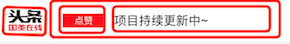,其中左边部份固定，右边的两部份为两按钮，通过给btn的layer添加CATransform3D来实现滚动，[实现源码](LBStoreMall-master/LBStoreMall/LBStoreMall/classes/common/DCNumericalScrollView/DCNumericalScrollView.m)
* section 2的实现思路如下：[自定义view](LBStoreMall-master/LBStoreMall/LBStoreMall/classes/view/home/第1组/LBSMHaoHuoHeadView.m) [自定义cell的源码（中间其实是一个collectionView,里面又有一些小的itemcell）](LBStoreMall-master/LBStoreMall/LBStoreMall/classes/view/home/第1组/LBSMHaoHuoCell.m)
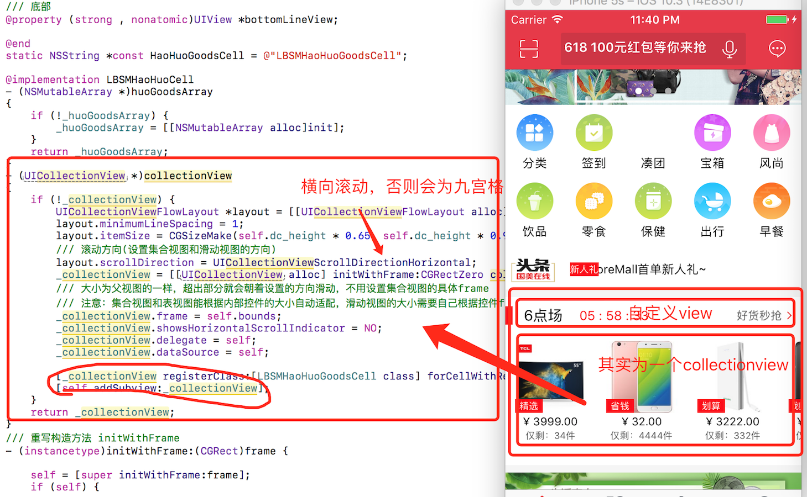

----
#####<a id="LBStoreMall_return_top" href="LBStoreMall-master/LBStoreMall/LBStoreMall/classes/controller/home/LBSMHomeController.m">快速返回顶部实现<a>
---

``` 
   1，首先按钮的位置固定在底部附近，默认隐藏
   2，在scrollView的代理方法中，判断是否显示:
       self.backTopButton.hidden = (scrollView.contentOffset.y > [UIScreen cz_screenHeight]) ? NO : YES;
   3，当点击按钮的时候调用
      [self.collectionView scrollRectToVisible:CGRectMake(0, 0, 1, 1) animated:YES];
      
``` 


-----


### 直播 https://github.com/ChinaArJun/Tencent-NOW 

[地址]( https://github.com/ChinaArJun/Tencent-NOW )

---

###酒运达 [来源](https://github.com/penghero/WTKMVVMRAC-master)  [ReadME](WTKMVVMRAC-master-master/README.md)
* 技术点： rectiveCocoa(把业务放在ViewMode里，减少了控制器代码)

``` 
绑定属性或viewMode：
RAC(TARGET, [KEYPATH, [NIL_VALUE]]):用于给某个对象的某个属性绑定。
// 只要文本框文字改变，就会修改label的文字
RAC(self.labelView,text) = _textField.rac_textSignal;
RACObserve(self, name) :监听某个对象的某个属性,返回的是信号。
//只要self.viewModel的headData发生了改变，就通知self.collectionView headArray
RAC(self.collectionView,headArray)  = RACObserve(self.viewModel, headData);
RACCommand:RAC中用于处理事件的类，可以把事件如何处理,事件中的数据如何传递，包装到这个类中，他可以很方便的监控事件的执行过程。(如按钮事件、网络请求)

```
* [RACCommand使用步骤](../MyiOSStudy/基本资料/ReactiveCocoa/README.md)
* 首页效果 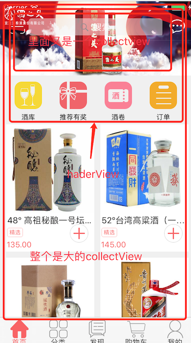,首页分为上、下部份，下面为一个大的collectView；上面又分为两部份：其中上半部份为一个collectionView,下半部份在collectionView下面添加一排按钮；头部下半份那一排按钮事件处理：


1，顶部自定义头部[WTKHomeHeadView](WTKMVVMRAC-master-master/WTKWineMVVM/WTKWineMVVM/Class/View/cell/WTKHomeHeadView.m)中

```
- (void)configView
{
    ....
    NSArray *lableArray = @[@"酒库",@"推荐有奖",@"酒卷",@"订单"];
    float buttonW = 50;// btn的边长
    for (int i=0; i<4; i++) {
        float columnInterval = (kWidth - 200)/5.0;
        
        float x = columnInterval+(buttonW+columnInterval)*i;
        float y = self.collectionView.frame.size.height + 10;
        
        UIButton *button=[UIButton buttonWithType:UIButtonTypeSystem];
        button.tag = 100 + i;
        button.frame = CGRectMake( x, y , 45, 45);
        ......
        [self addSubview:label];
        //订阅btn按钮事件
        [[button rac_signalForControlEvents:UIControlEventTouchUpInside] subscribeNext:^(id x) {
            @strongify(self);
            UIButton *btn = x;
            //将信号发送出去 ；self.btnSubject 在本类init方法中就初始化了
            [self.btnSubject sendNext:[NSNumber numberWithInteger:btn.tag]];
        }];
    }
}
```
2，[WTKHomeCollectionView](WTKMVVMRAC-master-master/WTKWineMVVM/WTKWineMVVM/Class/View/WTKHomeCollectionView.m)订阅按钮发出来的信号：

```

- (UICollectionReusableView *)collectionView:(UICollectionView *)collectionView viewForSupplementaryElementOfKind:(NSString *)kind atIndexPath:(NSIndexPath *)indexPath
{
    
    WTKHomeHeadView *head = [collectionView dequeueReusableSupplementaryViewOfKind:UICollectionElementKindSectionHeader withReuseIdentifier:@"header" forIndexPath:indexPath];
    head.dataArray = self.headArray.mutableCopy;
    NSLog(@"self.headArray:%d   %@",[self.headArray count],self.headArray);
    @weakify(self);
    [head.bannerSubject subscribeNext:^(id x) {
        @strongify(self);
        NSInteger num = [x integerValue];
        [self.viewModel.headCommand execute:self.headArray[num]];
    }];
    [head.btnSubject subscribeNext:^(id x) {
        @strongify(self);
        //执行viewModel中的业务方法
        [self.viewModel.btnCommand execute:x];
    }];
    return head;
}

```
3，[WTKHomeViewModel.m](WTKMVVMRAC-master-master/WTKWineMVVM/WTKWineMVVM/Class/ViewModel/WTKHomeViewModel.m)中

```

    self.btnCommand     = [[RACCommand alloc]initWithSignalBlock:^RACSignal *(id input) {
        NSLog(@"%@",input);
        NSInteger tag   = [input integerValue];
        switch (tag) {
            。。。。
            case 101:
            {
                WTKRecommendViewModel *viewModel = [[WTKRecommendViewModel alloc]initWithService:self.services params:@{@"title":@"推荐有奖"}];
                self.naviImpl.className = @"WTKRecommendVC";
                [self.naviImpl pushViewModel:viewModel animated:YES];
            }
            。。。
                break;
            default:
                break;
        }
        return [RACSignal empty];
    }];
    
```
* 分类效果：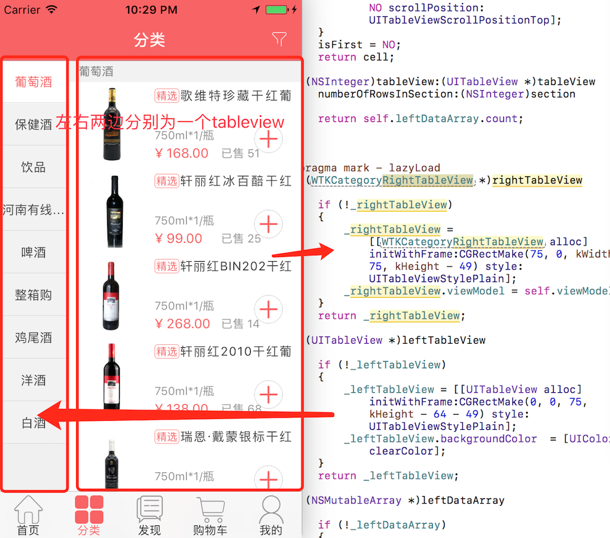,当点击左边table的时候：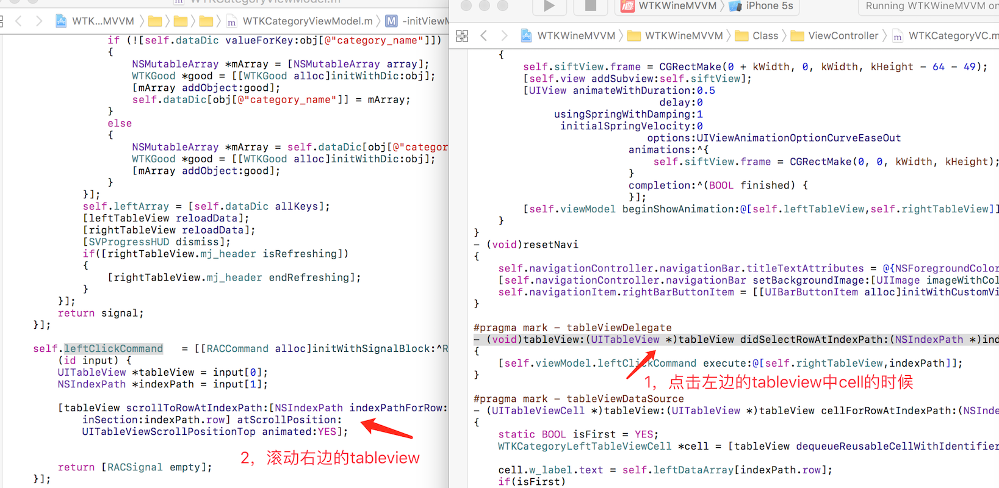，注意`        [tableView scrollToRowAtIndexPath:[NSIndexPath indexPathForRow:0 inSection:indexPath.row] atScrollPosition:UITableViewScrollPositionTop animated:YES];`，会滚动到指定section的第0行；
* [WTKGoodsVC商品行情分析](WTKMVVMRAC-master-master/WTKWineMVVM/WTKWineMVVM/Class/ViewController/WTKGoodsVC.m)
* 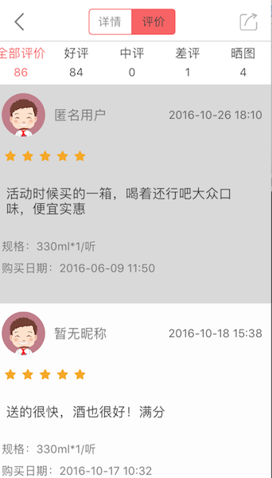 

* 订单状态 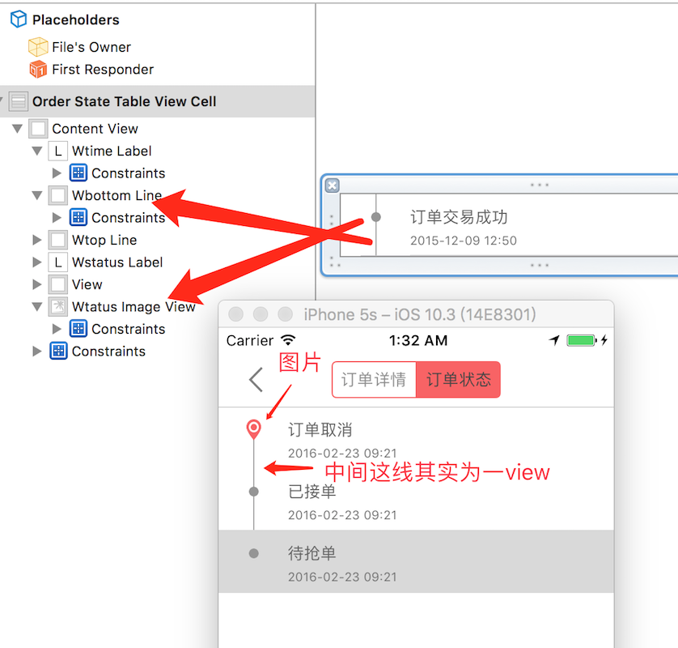
* 订单列表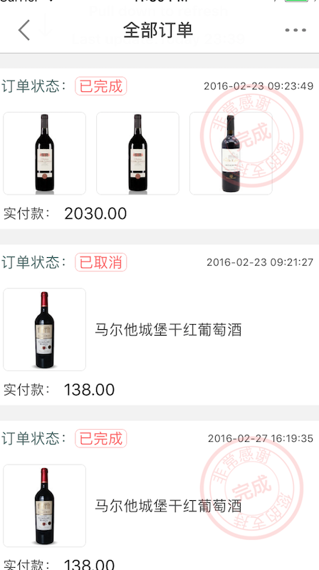

## [组件化项目](https://github.com/madaoCN/NonBaseClass-MVVM-ReactiveObjc) 
---


## Swift项目
----
### Swift-BanTang-master

---

###swift3.0高仿微信 https://github.com/shaoyanglichao01/LXFWeChat

* 微信页面
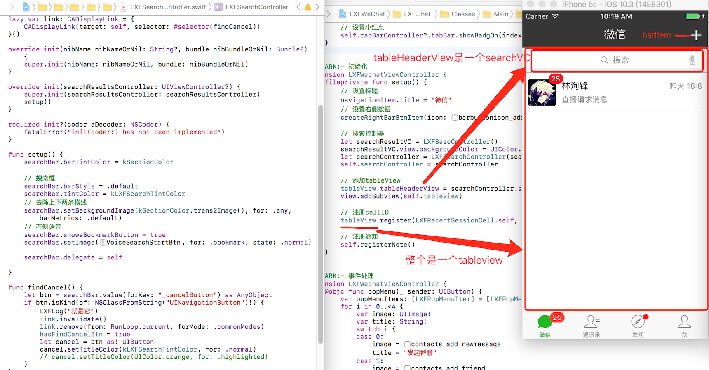

```
  1，顶部是一个itembar。注意：用了一个fixedSpace item来控制实际itembar的位置：
  fileprivate func addFixedSpace(with barItem: UIBarButtonItem, direction: BarBtnItemDirection) {
    let negativeSpacer = UIBarButtonItem(barButtonSystemItem: .fixedSpace, target: nil, action: nil)
    negativeSpacer.width = -11//negativeSpacer用来占位的
    switch direction {
    case .left:
        navigationItem.leftBarButtonItems = [negativeSpacer, barItem]
    default:
        navigationItem.rightBarButtonItems = [negativeSpacer, barItem]
    }
}

2，tableview用了懒加载
    // tableView
    lazy var tableView: UITableView = { [unowned self] in
        let tableView = UITableView(frame: self.view.bounds, style: .plain)
        .....      
        tableView.showsVerticalScrollIndicator = false
        tableView.contentInset = UIEdgeInsetsMake(64, 0, 44, 0)
        tableView.scrollIndicatorInsets = UIEdgeInsetsMake(64, 0, 44, 0)
        tableView.separatorInset = UIEdgeInsetsMake(0, 8, 0, 0)
        tableView.tableFooterView = UIView()
        return tableView
    }()
3, tableHeaderView对应上面的搜索，
	    // 搜索控制器
	let searchResultVC = LXFBaseController()
	searchResultVC.view.backgroundColor = UIColor.red
	let searchController = LXFSearchController(searchResultsController: searchResultVC)
	self.searchController = searchController
	    
	// 添加tableView
	tableView.tableHeaderView = searchController.searchBar
	
4，tableView中的Cell用到了SnapKit自动约束框架
    fileprivate func setup() {
        self.addSubview(avatarView)
        self.addSubview(nameLabel)
        self.addSubview(detailLabel)
        self.addSubview(timeLabel)
        self.addSubview(tipBadge)
        
        let margin: CGFloat = 10
        // 头像
        avatarView.snp.makeConstraints { (make) in
            make.left.top.equalTo(self).offset(margin)
            make.bottom.equalTo(self.snp.bottom).offset(-margin)
            make.height.equalTo(avatarView.snp.width)
        }
       
        //名字
        nameLabel.snp.makeConstraints { (make) in
            make.left.equalTo(avatarView.snp.right).offset(margin)
            make.top.equalTo(avatarView.snp.top).offset(margin * 0.5)
            make.right.equalTo(self.snp.right)
            make.bottom.equalTo(avatarView.snp.centerY).offset(-5)
        }
        
        //名字下面的灰色文字
        detailLabel.snp.makeConstraints { (make) in
            make.left.equalTo(nameLabel.snp.left)
            make.bottom.equalTo(avatarView.snp.bottom).offset(-margin * 0.5)
            make.top.equalTo(avatarView.snp.centerY).offset(5)
            make.right.equalTo(self.snp.right).offset(-15)
        }
        //最右边的时间
        timeLabel.snp.makeConstraints { (make) in
            make.right.equalTo(self.snp.right).offset(-10)
            make.top.equalTo(nameLabel.snp.top)
        }
        
         //头像上面的number,tipBadge是一个BadgeSwift，圆角：badge.cornerRadius = 9
        tipBadge.snp.makeConstraints { (make) in
            make.centerX.equalTo(avatarView.snp.right)
            make.centerY.equalTo(avatarView.snp.top)
        }
    }
  
```
* 通讯录
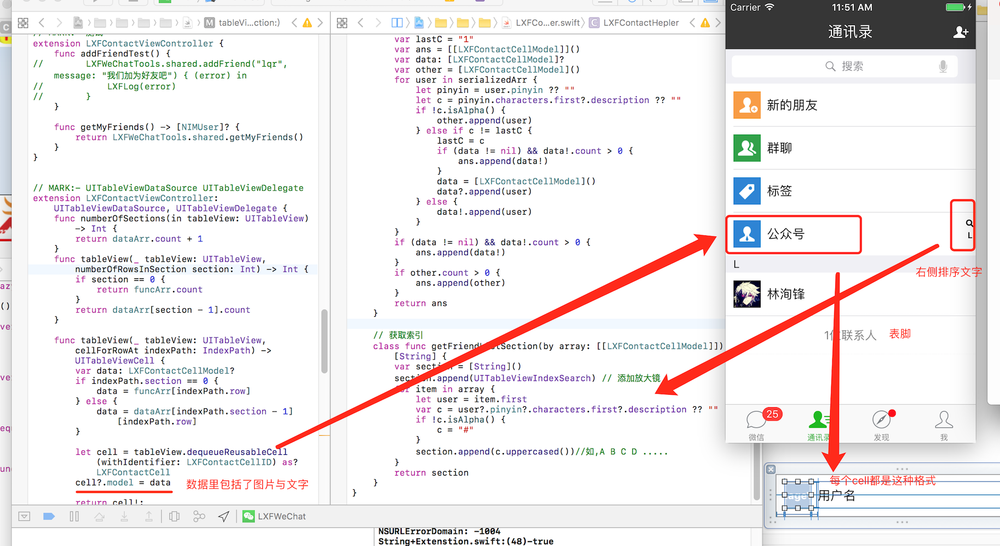

```
  1,每个cell其实都一样，左边图片+右边文字
  2，排序利用了tableview自带的排序
```

* 键盘界面：
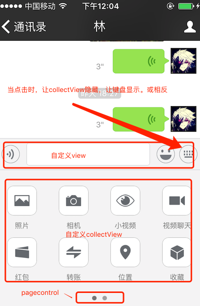

* 聊天界面的布局：
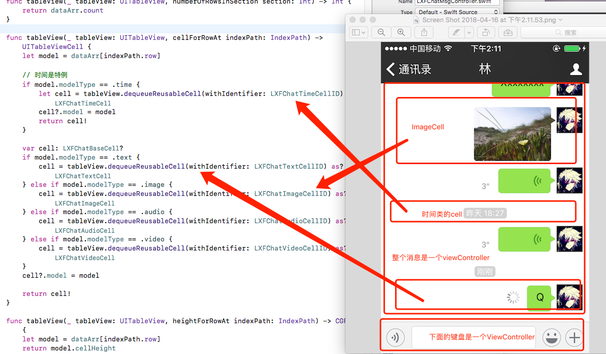
----


* '++' is deprecated: it will be removed in Swift 3
	
	```
	for var i = 0 ; i < data?.count; i++
	改为：
	for var i in 0..data.count 
	``` 
	* NSBundle.mainBundle.pathForResource
	
	```
	
	let path = NSBundle.mainBundle().pathForResource("tutorials", ofType: nil)
	修改为
	 let path = Bundle.main.url(forResource:"tutorials", withExtension: "json") 	
	
	``` 

#### [仿新浪微博中间凸起的tabBar](https://github.com/kangbingbing/KBCustomCenterTabbar)

--- 
* 效果图如：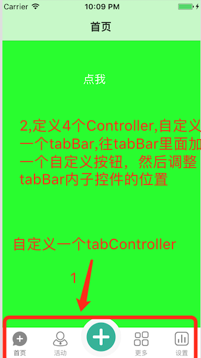 ,代码如图所示：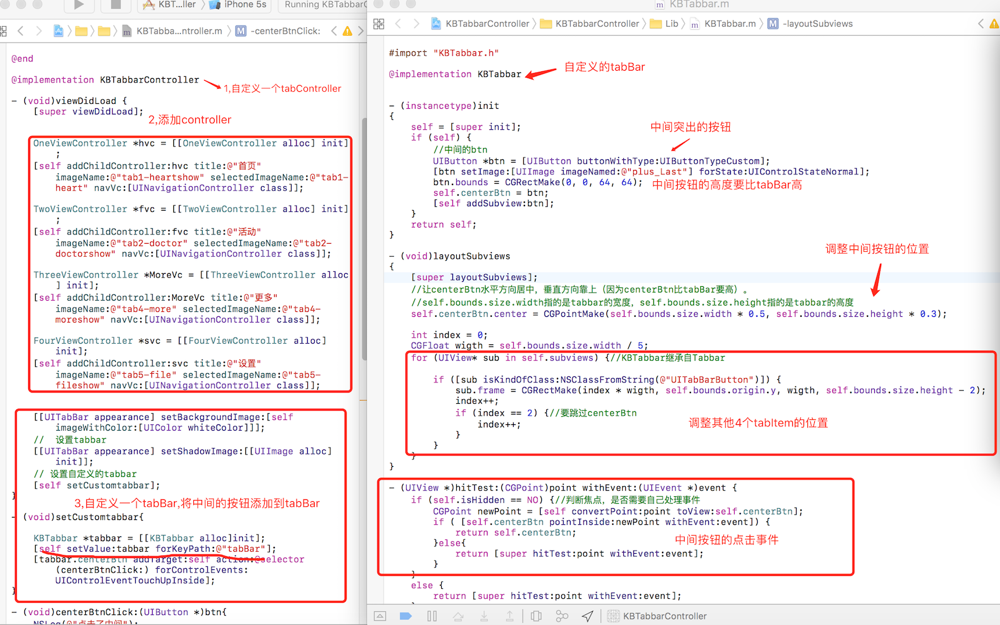
  
  ``` 
  注意点：
    1,由于系统TabController中的tabBar是子读的，我们采用KVC来替换系统的tabBar:
       [self setValue:tabbar forKeyPath:@"tabBar"];
    2,tabBar中的自定义按钮（中间那个按钮）高度要比tabBar高
    3，UITabBarButton的位置需要重新调整
    4，自定义UITabBar中需要重写hitTest方法，来判断是否需要自己处理事件   
  
  ``` 
----

#### 常用二维码效果图 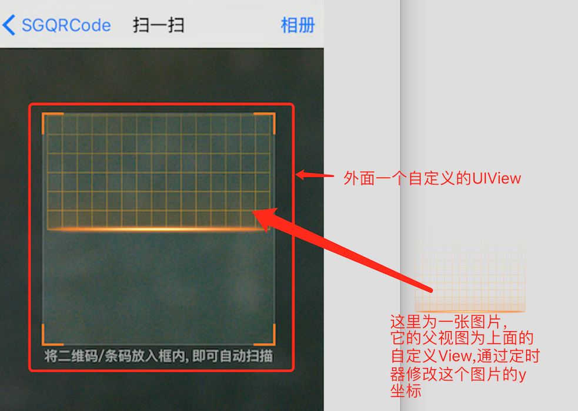 ，[自定义二维码View](https://github.com/kingsic/SGQRCode/blob/master/SGQRCode/SGQRCodeScanningView.m)  [二维码控制器](https://github.com/kingsic/SGQRCode/blob/master/SGQRCode/SGQRCodeScanManager.m)，实现思路：

```
  1，整个二维码页面为一个自定义的View,中间的框为一个自定义View:
	 /** 扫描内容的 W 值 */
	#define scanBorderW 0.7 * self.frame.size.width
	/** 扫描内容的 x 值 */
	#define scanBorderX 0.5 * (1 - 0.7) * self.frame.size.width
	/** 扫描内容的 Y 值 */
	#define scanBorderY 0.5 * (self.frame.size.height - scanBorderW)
	- (UIView *)contentView {//为中间框中自定义View
	    if (!_contentView) {
	        _contentView = [[UIView alloc] init];
	        _contentView.frame = CGRectMake(scanBorderX, scanBorderY, scanBorderW, scanBorderW);
	        _contentView.clipsToBounds = YES;
	        _contentView.backgroundColor = [UIColor clearColor];
	    }
	    return _contentView;
	} 
 2，在整个View的drawRect方法中绘制四周的边框线：
	 - (void)drawRect:(CGRect)rect {
	    [super drawRect:rect];
	    
	    /// 边框 frame
	    CGFloat borderW = scanBorderW;
	    CGFloat borderH = borderW;
	    CGFloat borderX = scanBorderX;
	    CGFloat borderY = scanBorderY;
	    CGFloat borderLineW = 0.2;
	
	    /// 空白区域设置
	    [[[UIColor blackColor] colorWithAlphaComponent:self.backgroundAlpha] setFill];
	    UIRectFill(rect);
	    .....
	 }
	
3,	添加定时器，并初始化中间移动图片的frame:
	#pragma mark - - - 添加定时器
	- (void)addTimer {
	    CGFloat scanninglineX = 0;
	    CGFloat scanninglineY = 0;
	    CGFloat scanninglineW = 0;
	    CGFloat scanninglineH = 0;
	    if (self.scanningAnimationStyle == ScanningAnimationStyleGrid) {
	        [self addSubview:self.contentView];
	        [_contentView addSubview:self.scanningline];
	        scanninglineW = scanBorderW;
	        scanninglineH = scanBorderW;
	        scanninglineX = 0;
	        scanninglineY = - scanBorderW;//其实scanningline的Y坐标已经偏移到父视图外面了
	        //让移动图片偏移到父视图外面
	        _scanningline.frame = CGRectMake(scanninglineX, scanninglineY, scanninglineW, scanninglineH);
	
	    } .....
	}
4，在定时器修改移动图片的frame:
	[UIView animateWithDuration:self.animationTimeInterval animations:^{
	    frame.origin.y += 2;
	    _scanningline.frame = frame;
	} completion:nil];	
    
``` 

-----


#### <span id="下拉刷新图片放大效果">[下拉刷新图片放大效果](https://github.com/IMLoser/HWMineImage)</span>
   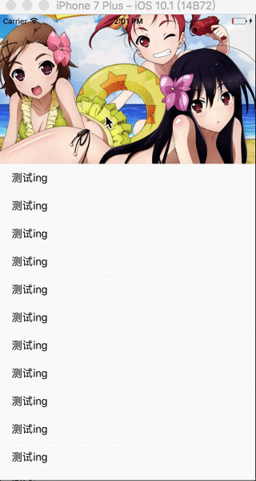实现思路如下：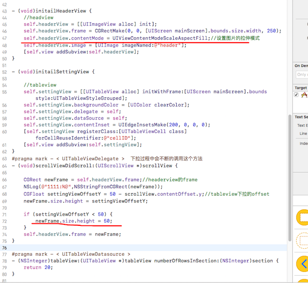

*    两个关键点：
	* 设置图片的拉伸模式为：UIViewContentModeScaleAspectFill
	* 下拉滚动的时候，在代理方法中不断的修改图片的高度，由于设置了拉伸模式，高度会自动跟着拉伸；    
   

-----

##### [仿《想去》首页的流水布局demo](https://github.com/ljunb/LJBLineLayoutDemo)
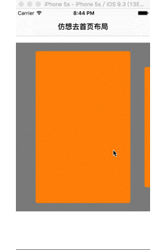

* 主要通过重写以下几个方法来实现：[可以参考](https://www.jianshu.com/p/0d197328083e)
	* - (NSArray<UICollectionViewLayoutAttributes *> *)layoutAttributesForElementsInRect:(CGRect)rect //返回rect中的所有的元素的布局属性
	* - (BOOL)shouldInvalidateLayoutForBoundsChange:(CGRect)newBounds //当边界发生改变时，是否应该刷新布局
	* - (CGPoint)targetContentOffsetForProposedContentOffset:(CGPoint)proposedContentOffset withScrollingVelocity:(CGPoint)velocity //这个方法简单理解可以当作是用来设置collectionView的偏移量的，计算当前屏幕哪个item中心点距离屏幕中心点近，就将该item拉到中心去。


####[今日头条](https://github.com/hrscy/TodayNews.git)


-----
####[新闻客户端项目](https://github.com/577528249/TTNews)

------

####[高仿黑迹天气](https://github.com/Zws-China/Weather)
----
#### 组件化方案
* [组件化1](http://www.code4app.com/thread-11117-1-1.html)
* [组件化2](http://www.code4app.com/thread-14917-1-1.html)
* [基于CTMediator的组件化中间件](https://github.com/wangshiyu13/Lothar)   [CTMediator Demo](https://github.com/yehot/YT_TargetAction)
* [JLRoutes Demo](https://github.com/huangjianguohjg/JLRoutes)

#### 音视频项目

----
* [高仿腾讯旗下[NOW]直播](https://github.com/ChinaArJun/Tencent-NOW)
* [WebRTC音频通信](https://github.com/tuyaohui/WebRTC_iOS)
* [网易云信 UI 组件](https://github.com/netease-im/NIM_iOS_UIKit)

----


####
------
* [各类开源的app收集](https://github.com/dkhamsing/open-source-ios-apps)

----

#### CocoaPods私有库
* [私有库的创建](https://www.jianshu.com/p/0c640821b36f)

-----
	
* 常用第三方库
	* [首页轮播图 ](https://github.com/gsdios/SDCycleScrollView)
	* [ReactiveCocoa 响应式编程](https://github.com/AllenSWB/ReactiveCocoaStudy)
	* [二维码](https://github.com/kingsic/SGQRCode)
	* [Swift 自动布局框架SnapKit](http://www.hangge.com/blog/cache/detail_1097.html)
	*  [侧滑菜单库](https://github.com/John-Lluch/SWRevealViewController) 	

----
* collectionview demo
	* [https://github.com/jasnig/CollectionViewLayout](https://github.com/jasnig/CollectionViewLayout)  
	* [https://www.jianshu.com/p/cabec2786241](https://www.jianshu.com/p/cabec2786241) 
	* [https://www.jianshu.com/p/45ff718090a8](https://www.jianshu.com/p/45ff718090a8)	
	* [仿想去网流水布局](https://github.com/ljunb/LJBLineLayoutDemo)