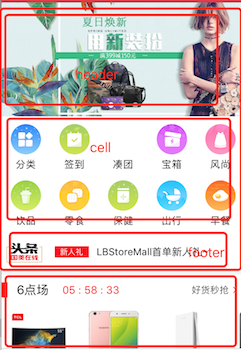

* OC项目

## LBStoreMall 电商，只弄了首页
[来源](https://github.com/lb2281075105/LBStoreMall) [本地](LBStoreMall/LBStoreMall)

*  tabBar的封装


````
   1，继承自UITabBarController
   2，封装一个方法添加nav控制器
   ///添加子控制器
	- (void)addChildViewController:(UIViewController *)childController withNormalImage:(NSString *)normalImage withSelectImage:(NSString *)selectImage withTitle:(NSString *)title{	
	    .....
	    LBSMNavController *nav = [[LBSMNavController alloc]initWithRootViewController:childController];
	    nav.tabBarItem.image = [[UIImage imageNamed:normalImage]imageWithRenderingMode:UIImageRenderingModeAlwaysOriginal];
	    nav.tabBarItem.selectedImage = [[UIImage imageNamed:selectImage]imageWithRenderingMode:UIImageRenderingModeAlwaysOriginal];
	    ///（当只有图片的时候）需要自动调整
	    nav.tabBarItem.imageInsets = UIEdgeInsetsMake(6, 0,-6, 0);
	
	    [self addChildViewController:nav];
	}
	3，在viewdidload方法里面调用addChildViewController添加控制器
````

* 顶部导航栏的实现


````
1,红色背景为颜色：
    self.navigationController.navigationBar.barTintColor = LBSMColor(231, 23, 37);
2，左右两边分别为leftBarButtonItem和rightBarButtonItem
	self.navigationItem.leftBarButtonItem = [UIBarButtonItem ItemWithImage:[UIImage imageNamed:@"richScan"] WithHighlighted:[UIImage imageNamed:@"richScan"] Target:self action:@selector(richScanItemClick)];
    self.navigationItem.rightBarButtonItem = [UIBarButtonItem ItemWithImage:[UIImage imageNamed:@"message"] WithHighlighted:[UIImage imageNamed:@"message"] Target:self action:@selector(messageItemClick)];
3,中间部份为一个自定义view，中间那个view的核心代码如下：
	- (void)addSubviews{
	    /// 设置圆角
	    UIBezierPath *maskPath = [UIBezierPath bezierPathWithRoundedRect:self.bounds byRoundingCorners:UIRectCornerTopLeft | UIRectCornerTopRight | UIRectCornerBottomLeft | UIRectCornerBottomRight cornerRadii:CGSizeMake(2, 2)];
	    CAShapeLayer *maskLayer = [[CAShapeLayer alloc] init];
	    maskLayer.frame = self.bounds;
	    maskLayer.path = maskPath.CGPath;
	    self.layer.mask = maskLayer;
	    self.placeholder = _title;
	    if (_orTrue) {
	        //用KVC设置placeholder的文字颜色与字体
	        [self setValue:[UIColor whiteColor] forKeyPath:@"_placeholderLabel.textColor"];
	        [self setValue:[UIFont boldSystemFontOfSize:14] forKeyPath:@"_placeholderLabel.font"];
	        /// 搜索按钮
	        _rightBtn = [UIButton buttonWithType:UIButtonTypeCustom];
	        [_rightBtn setImage:[UIImage imageNamed:@"voice"] forState:UIControlStateNormal];
	        [_rightBtn addTarget:self action:@selector(rightButtonClick) forControlEvents:UIControlEventTouchUpInside];
	        [self addSubview:_rightBtn];
	        [_rightBtn mas_makeConstraints:^(MASConstraintMaker *make) {//自定义view右边按钮的约束
	            make.centerY.equalTo(self);
	            make.height.with.equalTo(@20);
	            make.right.equalTo(self).offset(-5);
	        }];
	
	    }else{
	        [self setValue:[UIColor whiteColor] forKeyPath:@"_placeholderLabel.textColor"];
	        [self setValue:[UIFont boldSystemFontOfSize:14] forKeyPath:@"_placeholderLabel.font"];
	    }
	}
	   
````
* [首页的布局的实现](LBStoreMall-master/LBStoreMall/LBStoreMall/classes/controller/home/LBSMHomeController.m)



````
 1，整个首页内容是一个UICollectionView，其中UICollectionView分成了五个section,第个section又分为头、cell、尾；

	 - (UICollectionView *)collectionView{
	    if (_collectionView == nil) {
	        UICollectionViewFlowLayout *layout = [[UICollectionViewFlowLayout alloc]init];
	        _collectionView = [[UICollectionView alloc]initWithFrame:CGRectZero collectionViewLayout:layout];
	        /// 不用设置集合视图的具体frame
	        /// 需要时设置滑动方向
	        _collectionView.frame = CGRectMake(0, 64, [UIScreen cz_screenWidth], [UIScreen cz_screenHeight] - 64 - 49);
	        _collectionView.showsVerticalScrollIndicator = NO;
	        _collectionView.delegate = self;
	        _collectionView.dataSource = self;
	        /// cell
	        [_collectionView registerClass:[LBSMHomeGridCell class] forCellWithReuseIdentifier:HomeGridCell];
	        [_collectionView registerClass:[LBSMHaoHuoCell class] forCellWithReuseIdentifier:HaoHuoCell];
	        [_collectionView registerClass:[LBSMNeedLifeCell class] forCellWithReuseIdentifier:NeedLifeCell];
	        [_collectionView registerClass:[LBSMPinPaiJingXuanCell class] forCellWithReuseIdentifier:PinPaiJingXuanCell];
	        [_collectionView registerClass:[LBSMHotCommendCell class] forCellWithReuseIdentifier:HotCommendCell];
	
	        /// header
	        //轮播图
	        [_collectionView registerClass:[LBSMSlideshowHeadView class] forSupplementaryViewOfKind:UICollectionElementKindSectionHeader withReuseIdentifier:SlideshowHeadView];
	        [_collectionView registerClass:[LBSMHaoHuoHeadView class] forSupplementaryViewOfKind:UICollectionElementKindSectionHeader withReuseIdentifier:HaoHuoHeadView];
	        [_collectionView registerClass:[LBSMPinPaiHeaderView class] forSupplementaryViewOfKind:UICollectionElementKindSectionHeader withReuseIdentifier:PinPaiHeaderView];
	        [_collectionView registerClass:[LBSMHotCommendHeadView class] forSupplementaryViewOfKind:UICollectionElementKindSectionHeader withReuseIdentifier:HotCommendHeadView];
	        
	        /// footer
	        [_collectionView registerClass:[LBSMTopFooterView class] forSupplementaryViewOfKind:UICollectionElementKindSectionFooter withReuseIdentifier:TopFooterView];
	        [_collectionView registerClass:[LBSMScrollAdFootView class] forSupplementaryViewOfKind:UICollectionElementKindSectionFooter withReuseIdentifier:ScrollAdFootView];
	        [_collectionView registerClass:[LBSMHotCommendFootView class] forSupplementaryViewOfKind:UICollectionElementKindSectionFooter withReuseIdentifier:HotCommendFootView];
	        [self.view addSubview:_collectionView];
	        
	    }
	    return _collectionView;
	}

2，返回中间cell部份实现：
   - (UICollectionViewCell *)collectionView:(UICollectionView *)collectionView cellForItemAtIndexPath:(NSIndexPath *)indexPath 
   返回头、尾实现：	
  - (CGSize)collectionView:(UICollectionView *)collectionView layout:(UICollectionViewLayout *)collectionViewLayout sizeForItemAtIndexPath:(NSIndexPath *)indexPath	


````


* section 1的顶部焦点图滚动采用了一个第三方框架来[实现](LBStoreMall-master/LBStoreMall/LBStoreMall/classes/view/home/第0组/LBSMSlideshowHeadView.m)
* section 1的顶部焦点图上下滚动分为三部份：


----
### 直播 https://github.com/ChinaArJun/Tencent-NOW 

[地址]( https://github.com/ChinaArJun/Tencent-NOW )

---

###酒运达 [来源](https://github.com/penghero/WTKMVVMRAC-master)
[ReadME](WTKMVVMRAC-master-master/README.md)

* Swift项目
----
### Swift-BanTang-master

---

###swift3.0高仿微信 https://github.com/shaoyanglichao01/LXFWeChat

----

	* '++' is deprecated: it will be removed in Swift 3
	
	```
	for var i = 0 ; i < data?.count; i++
	改为：
	for var i in 0..data.count 
	``` 
	* NSBundle.mainBundle.pathForResource
	
	```
	
	let path = NSBundle.mainBundle().pathForResource("tutorials", ofType: nil)
	修改为
	 let path = Bundle.main.url(forResource:"tutorials", withExtension: "json") 	
	
	``` 
* 常用第三方库
	* [首页轮播图 ](https://github.com/gsdios/SDCycleScrollView)